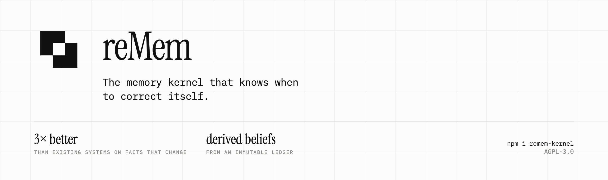

# reMem

reMem is a memory kernel: it turns a stream of observations (messages, notes,
events) into a model of a person that can be queried, explained, decayed, and
forgotten. It is a research-stage TypeScript library, not a hosted product.

The one idea it is built around: **separate the immutable ledger from the
derived belief layer.**

- **Ledger.** Every observation is written once, append-only, with its source,
  timestamp, and context. Nothing is ever updated or deleted except explicit
  user erasure. This is truth-of-record.
- **Beliefs.** Derived, mutable, confidence-scored, scoped, decaying facts
  about the person. An LLM proposes typed operations over the ledger
  (`CREATE`, `REINFORCE`, `CONTRADICT`, `REFINE`, `NOOP`); a deterministic
  reducer applies them. When new evidence conflicts with an existing belief,
  `CONTRADICT` marks the old belief superseded instead of silently appending a
  second, contradictory row next to it.

Most memory systems collapse these into one mutable store: extract a fact,
write it, and if a later fact conflicts, either overwrite it or leave both
sitting in the index for the retriever to sort out. That is workable until a
user's preference or a project's status actually changes, at which point nothing
tells you which fact is current or why. reMem keeps the two apart so that
supersession, decay, forgetting, and provenance are queries against structured
state rather than problems for the retriever to guess at.

This README reports where that idea helps and where it does not. Both are
below, with the harness, the sample size, and the significance test for each
number.

## Why not just a vector store

A pure embed-and-retrieve-by-cosine-similarity system cannot answer:

- What does the user currently believe, when two things they said conflict?
- Why do you believe that? (no provenance chain back to source)
- Is this true in this context but not in another?
- Should you say nothing rather than guess?

reMem's belief layer is aimed at the first two. The evidence below shows it
delivers on the first, on a narrow and specific class of questions, at a real
compute cost, and does not yet show an effect on the rest.

## Install and quickstart

Published as [`remem-kernel`](https://www.npmjs.com/package/remem-kernel), for
use as a Claude Code plugin, an MCP server, or a library. Requires Node 20+;
the plugin also requires Claude Code.

For Claude Code, one command:

```bash
npx remem-kernel setup
```

It adds the reMem marketplace from GitHub, installs the plugin, fetches the
kernel into `~/.remem/runtime`, points the plugin's hooks at that kernel, and
runs doctor to confirm the install works. It only does the steps that are not
already done, so re-running it is safe, and re-running it is also how you
upgrade (`npx remem-kernel@latest setup`, so npx does not reuse a cached older
copy). `--dry-run` prints the plan without changing anything.

Setup does not put reMem's other commands on your PATH. Run them through npx:
`npx remem-kernel doctor`, and `npx -p remem-kernel <command>` for
`remem-import`, `remem-consolidate` and `remem-viewer`. A global install
(`npm i -g remem-kernel`) still provides all of them as bare commands.

If you would rather use Claude Code's own plugin commands:

```bash
claude plugin marketplace add ManasVardhan/reMem && claude plugin install remem@remem
```

To use the kernel as a library:

```bash
npm i remem-kernel
```

To work on the kernel itself, build from source instead:

```bash
git clone https://github.com/ManasVardhan/reMem
cd reMem
pnpm install
pnpm build
```

The kernel exposes eight methods. `observe` and `recall` work with no LLM
configured; `consolidate` requires a `Consolidator`.

```ts
import { ReMemKernel, HashingEmbedder } from "remem-kernel";

const kernel = new ReMemKernel({
  db: { path: "./memory.db" },
  embedder: new HashingEmbedder(), // dependency-free default; swap in TransformersEmbedder for real recall
});

await kernel.observe({
  source: "slack",
  actor: "user",
  content: "I prefer concise code review comments, no fluff.",
});

const pack = await kernel.recall(
  "how does the user like code review feedback?",
  {},
);
console.log(pack.text, pack.abstained);
```

To fold observations into confidence-scored beliefs, pass a consolidator.
`LLMConsolidator` talks to any OpenAI-compatible chat completions endpoint:

```ts
import {
  ReMemKernel,
  LLMConsolidator,
  createOpenAICompleter,
} from "remem-kernel";

const kernel = new ReMemKernel({
  db: { path: "./memory.db" },
  consolidator: new LLMConsolidator({
    complete: createOpenAICompleter({ model: "gpt-4o-mini" }),
  }),
});

await kernel.consolidate(); // LLM proposes ops, reducer applies them
const report = kernel.decay(); // deterministic, no LLM, archives beliefs below the confidence floor
const beliefs = kernel.beliefs(); // active beliefs
const why = kernel.why(beliefs[0].id); // belief + the observations that justify it
await kernel.forget(beliefs[0].id); // explicit user erasure
const snapshot = await kernel.export(); // full JSON snapshot; the user owns their data
```

For an assistant integration, `MemoryService` wraps the kernel in two hooks
(`record` on every turn, `contextBlock` at prompt-assembly time) and handles
buffering and auto-consolidation:

```ts
import { createMemoryService, defaultDbPath } from "remem-kernel";

const memory = createMemoryService({ path: defaultDbPath() });
await memory.record({ actor: "user", content: "Ship the reMem README today." });
const ctx = await memory.contextBlock("what is the user working on?");
if (!ctx.abstained) promptText += ctx.text;
```

## Using it with an agent

Two artifacts sit over one store at `~/.remem/remem.db` (override with
`REMEM_DB`). Beliefs carry a scope, so a fact about a repository stays in that
repository while a fact about you follows you everywhere.

### As an MCP server

Runs in any MCP client. Seven tools, in two groups.

What memory holds:

| Tool                       | What it does                                                         |
| -------------------------- | -------------------------------------------------------------------- |
| `recall(query, project?)`  | Ranked context pack, with belief ids. Abstains rather than guessing. |
| `remember(text, project?)` | Appends an observation. No model call.                               |
| `beliefs()`                | Active beliefs with ids and time-decayed confidence.                 |
| `why(belief_id)`           | The belief plus the observations that justify it.                    |

What happened, for questions about past sessions:

| Tool                                      | What it does                                                                                        |
| ----------------------------------------- | --------------------------------------------------------------------------------------------------- |
| `search(query, project?, kinds?, limit?)` | Keyword search over the ledger, the episodes and the beliefs. Ids first, so the next call is cheap. |
| `observation(id)`                         | One observation or episode in full, plus what memory made of it.                                    |
| `history(anchor?, before?, after?)`       | What surrounded a moment, so a single result can be read in context.                                |

`search` is deliberately separate from `recall`. `recall` answers "what should I
know before replying" and abstains; `search` answers "when did we last touch
this" and returns an index to page through.

`decay`, `forget`, and `export` are deliberately absent: they are maintenance,
and `forget` is a footgun in a surface a model chooses from.

```bash
claude mcp add remem -- npx -p remem-kernel remem-mcp
```

Any other MCP client can run the same command as a stdio server:

```json
{
  "mcpServers": {
    "remem": { "command": "npx", "args": ["-p", "remem-kernel", "remem-mcp"] }
  }
}
```

### As a Claude Code plugin

The plugin adds what MCP alone cannot: memory that accumulates without the model
deciding to save anything. Three hooks, matching the kernel's cost split.

| Hook               | Action                                                       | Cost            |
| ------------------ | ------------------------------------------------------------ | --------------- |
| `SessionStart`     | Injects in-scope beliefs, highest confidence first           | cheap           |
| `UserPromptSubmit` | Appends your message to the ledger                           | cheap, no model |
| `SessionEnd`       | Consolidates the session into beliefs and writes its episode | one model call  |

`UserPromptSubmit` records a line in the ledger. It does not call a model: that
is the difference between reMem and memory layers that summarise as they go, and
it is why saving a memory costs nothing per message. The readable account of a
session, which is the thing those layers spend model calls on, is derived once at
`SessionEnd` from observations already recorded.

Install it with `npx remem-kernel setup` (see
[Install and quickstart](#install-and-quickstart)), then restart Claude Code to
load the hooks.

The plugin also adds `/remember` (what memory holds for this project, and why)
and `/recall <topic>` (search past sessions).

To upgrade, run `npx remem-kernel@latest setup`. `npx remem-kernel doctor`
reports the plugin and kernel versions side by side, so you can see any skew
rather than guess at it, and setup itself fails if they still differ when it
finishes.

When working from a checkout rather than the published package, point the
marketplace at the repo instead and set `REMEM_SRC` to the repo root so the
hooks load the built kernel from there:

```bash
claude plugin marketplace add /path/to/reMem
export REMEM_SRC=/path/to/reMem
```

### Consolidation providers

`consolidate()` needs a model. reMem picks one automatically, in order:

1. **Claude Agent SDK**, if installed. Inherits your Claude Code auth, so there
   is nothing to configure.
2. **The `claude` CLI**, if it is on your PATH. Same auth, nothing to install:
   if you are running the plugin, this is the one you get.
3. **Anthropic API**, if `ANTHROPIC_API_KEY` is set. A single request, and the
   faster path.
4. **Any OpenAI-compatible endpoint**, if `OPENAI_API_KEY` is set.

Force one with `REMEM_CONSOLIDATOR_PROVIDER`. If none is available, that is not
an error: observations stay in the ledger for a later pass.

### Bringing an existing memory across

If you already use claude-mem, one command moves it over. It finds the database
itself, and running it twice imports nothing the second time.

```bash
npx -p remem-kernel remem-import              # everything
npx -p remem-kernel remem-import --dry-run    # report first
```

The mapping is not one to one, because the two systems mean different things by
"observation":

| claude-mem        | reMem                    | why                                                                       |
| ----------------- | ------------------------ | ------------------------------------------------------------------------- |
| user prompts      | ledger observations      | the only thing in that store a person actually said                       |
| observations      | episodes                 | a model's account of work, written after the fact, so not ledger material |
| session summaries | episodes, kind `session` | the same artefact at a coarser grain                                      |
| sessions          | sessions                 | unchanged                                                                 |

Each imported episode links to the turn that produced it, so provenance still
holds after the move: an imported account resolves to a real prompt.

Beliefs are not imported, because they were never there to import. Derive them
from the ledger you just brought across:

```bash
npx -p remem-kernel remem-consolidate --sessions 20    # the 20 most recent
npx -p remem-kernel remem-consolidate --all            # from the beginning
```

### Viewing memory

With the plugin installed the viewer is already running: `SessionStart` starts
one if none is up, detached, so it survives the session that started it and is
there the next time you look. `~/.remem/viewer.json` holds the port it chose.

To run one by hand, or without the plugin:

```bash
npx -p remem-kernel remem-viewer     # pnpm viewer, from a checkout
# View Observations Live @ http://localhost:37800
```

Set `REMEM_VIEWER=off` if you would rather it stayed shut.

The page opens on the ledger: everything you have said, newest first, with what
memory currently believes folded above it. Click anything you said to see it in
full, what memory made of it, and the accounts drawn from it. Click a belief to
see the observations that justify it and the value it superseded. That triple is
what a flat memory store cannot show.

It is read-only, binds to loopback only, makes no network requests of its own,
and picks the first free port from 37800 upward.

## Public surface

The kernel is deliberately small. `ReMemKernel` (`src/kernel.ts`):

```ts
observe(input: ObservationInput): Promise<ObservationRecord>;      // write path, no LLM
consolidate(options?: ConsolidateOptions): Promise<ConsolidationReport>; // LLM proposes, reducer disposes
decay(options?: DecayOptions): DecayReport;                        // deterministic, archives stale beliefs
recall(query: string, context?: RecallContext, options?: RecallOptions): Promise<ContextPack>;
beliefs(filter?: BeliefFilter): BeliefRecord[];
why(beliefId: string): Provenance;                                  // belief + justifying observations
forget(beliefId: string): Promise<void>;                            // explicit user erasure
export(): Promise<KernelSnapshot>;                                  // full JSON snapshot
```

Reading back what happened is bookkeeping over that surface, not a new memory
process. Sessions group the observations that arrived together; episodes are a
derived, rewritable account of a stretch of work, and like a belief each one
must resolve to the observations behind it:

```ts
sessions(query?: SessionQuery): SessionRecord[];
episodes(query?: EpisodeQuery): EpisodeRecord[];
whyEpisode(id: string): { episode: EpisodeRecord; observations: ObservationRecord[] };
search(query: SearchQuery): SearchResult;      // lexical, what a person types
timeline(options: TimelineOptions): TimelineEntry[];
beliefsFrom(observationId: string): BeliefRecord[];   // why(), read backwards
```

`search` is not `recall`. `recall` ranks semantically and packs a context window
for an agent, and abstains when nothing fits. `search` is the box a person types
into, and returns what matched.

Everything else in `src/index.ts` (the BM25 index, the reducer, the eval
harness, the LoCoMo loader) is a client of this surface or a tool for
reproducing the numbers below.

## Benchmarks

reMem publishes losses alongside wins. Every number below is recorded, with
its run and commands, in `docs/FINDINGS.md`; nothing here is rounded or
recomputed from a different sample. Per-question result files for the
MemoryAgentBench, density and in-house harness runs are committed under
`eval/`; the MemoryBench (LoCoMo, PrefEval) run artifacts live in a local
MemoryBench checkout and are not in this repository. The conflict-resolution
and preference results are also reported in the
[paper](https://openreview.net/forum?id=CLGN0pqSQK).

### Conflict resolution: MemoryAgentBench, `factconsolidation_sh_6k`

100 questions, identical set across systems, answerer `gpt-4o-mini`,
`substring_exact_match`. This is the one benchmark where reMem's belief layer
(the `CONTRADICT` mechanism) has a demonstrated, statistically significant
effect, isolated by an ablation of that mechanism alone.

| System                  | Correct    | Ingest  | Context / question |
| ----------------------- | ---------- | ------- | ------------------ |
| Zep, bi-temporal edges  | **62/100** | 578.7 s | 5,159 tok          |
| reMem, supersession on  | 45/100     | 166.0 s | 594 tok            |
| reMem, supersession off | 29/100     | 118.4 s | 474 tok            |
| No-memory baseline      | 15/100     | 3.8 s   | 203 tok            |

The no-memory baseline is mem0 run through MemoryAgentBench's reference
adapter. That adapter extracted no facts from the benchmark's encyclopedic
context (mem0's extraction prompt targets user-specific information), so mem0
answered every question from an empty memory. A replay of the same ingestion
extracted zero facts, the per-question input length matches an empty memory
block for all 400 questions, and every answer it got right is the real-world
value. This row measures the answerer's parametric knowledge, not mem0.

**The mechanism result is the ablation**: supersession on versus off, with
embedder, candidate generation, chunking, and answerer held constant, is 45
against 29, a 16-point difference, paired McNemar exact p = 0.007. Read as a
ladder: no memory 15, retrieval 29, supersession 45, Zep 62. reMem's 45 against
the no-memory baseline's 15 is a margin over no memory (p = 1.4e-06), not a
comparison with mem0's memory; at a larger 32k context it is 57.0 against 23.0
for the same baseline (p = 1.9e-08). **Zep beats reMem by 17 points**, paired
McNemar exact p = 0.006. Multi-hop variants (chaining through more than one
superseded fact) collapse for every system tested, all under 6%, no significant
differences.

reMem's honest position here is efficiency, not accuracy leadership: 8.7x less
context than Zep and 3.5x faster ingest, at 17 points lower accuracy.

### Episodic QA: LoCoMo, via Supermemory's MemoryBench (unmodified)

50 questions, stratified sample, identical question set passed to every
provider. **This result is retrieval only: the belief layer (consolidation)
was switched off.** It measures reMem's recall path with an 800-character
neighbour-expansion budget, not the belief layer.

| System                                        | Accuracy  | Context tokens | Notes                                 |
| --------------------------------------------- | --------- | -------------- | ------------------------------------- |
| chunked RAG baseline                          | **68.0%** | 2,735          | beats every memory system tested      |
| filesystem baseline                           | 54.0%     | 2,683          |                                       |
| reMem (belief layer off, 800-char neighbours) | 54.0%     | 2,602          | ties filesystem, trails RAG by 14 pts |
| mem0                                          | 34.0%     | 549            | 0/10 on multi-hop                     |

**A plain chunked-RAG baseline beats every memory system tested, including
reMem.** reMem does beat mem0 by 20 points (paired McNemar p = 0.031); mem0
scored 0 of 10 on multi-hop questions in this run because its extraction
resolved relative dates ("yesterday") against wall-clock ingest time instead
of the conversation's session date. reMem's search is fast because it is
local: 27 ms median vs mem0's 492 ms over the network. That is a locality
comparison, not a quality claim.

### Preference following: PrefEval, via MemoryBench

75 instances, 25 per form, identical question set.

| System     | Accuracy | Context tokens |
| ---------- | -------- | -------------- |
| rag        | 34.7%    | 217            |
| reMem      | 33.3%    | 1,361          |
| filesystem | 32.0%    | 205            |
| mem0       | 29.3%    | 176            |

**Every pairwise comparison is null** (p >= 0.755, paired McNemar exact).
reMem sits mid-pack and uses 6-8x more context than the baselines for no
measurable accuracy gain. This is the benchmark the belief layer was expected
to win on, and it does not show an effect against external systems. Read the
mem0 row with care: under this harness's ingestion, mem0 retrieved no memories
for 48 of the 75 questions, and all 48 scored incorrect (cause unconfirmed).
The rag and filesystem comparisons are unaffected.

### What this adds up to

reMem's demonstrated advantages are efficiency and locality, not accuracy
leadership: roughly 8.7x less context than Zep and 3.5x faster ingest on
conflict resolution, and search that runs on-device instead of over a network.
Its belief layer has one clear, narrow, statistically significant effect:
on single-hop conflict resolution, turning supersession on adds 16 points over
the same system with it off, and it comes at a real ingest-time cost (166 s
against 118 s). Outside that slice, on episodic recall and on preference
following, reMem is unremarkable or indistinguishable from baselines that do far
less work. Treat any accuracy claim about reMem as scoped to the benchmark and
condition it was measured under.

## Reproducing these numbers

```bash
pnpm eval            # synthetic hermetic benchmark against no-memory / full-context / naive-vector baselines
pnpm eval:locomo     # real LoCoMo dialogues, retrieval-only scoring (recall@k / MRR / abstention)
pnpm eval:density    # contradiction-density classifier over LoCoMo / PrefEval / factconsolidation
pnpm serve:mem0-adapter  # mem0-OSS-compatible HTTP adapter, so external harnesses can score reMem
```

The MemoryAgentBench and MemoryBench numbers above were produced by running
those third-party harnesses (unmodified, MIT-licensed) against `pnpm
serve:mem0-adapter` or against the kernel directly; see `docs/FINDINGS.md`
entries F6 through F13 for the exact commands, artifact paths, and the defects
found and fixed along the way (including seven in the benchmark's own Zep
adapter, documented in F12, none of them reMem's).

## Architecture

- **TypeScript, strict**, one stack across write path, read path, and eval
  harness.
- **Single embedded SQLite database** as the source of truth (`better-sqlite3`
  today; the design targets libSQL/Turso so sync is a driver swap, not a
  rewrite). The "graph" is a plain edge table. Vectors are stored as blobs on
  the row and scored in-process today; `sqlite-vec` virtual tables for KNN are
  the planned path, not yet wired in. No separate vector database, no graph
  database.
- **Local-first.** The default embedder is `HashingEmbedder` (dependency-free,
  for tests and hermetic evals); `TransformersEmbedder` runs real embedding
  models on-device via `@huggingface/transformers`, an optional dependency, so
  the user's model never has to leave the device. API embedders are opt-in for
  speed.
- **Provider-agnostic consolidation.** `LLMConsolidator` talks to any
  OpenAI-compatible `/chat/completions` endpoint (OpenAI, OpenRouter, local
  servers) with no vendor SDK dependency. The consolidator only proposes typed
  ops; a separate deterministic reducer (`applyOps`) applies them, so no LLM
  output can mutate belief state unbounded.
- **Ledger integrity enforced in the database**: triggers reject `UPDATE` and
  `DELETE` on the observation table; explicit user erasure is a separate,
  privileged path.
- Decay is deterministic: `effective_confidence = base * exp(-lambda * dt)`,
  and beliefs below a floor are archived, not deleted.

## Status

Published as `remem-kernel` under AGPL-3.0, pre-1.0 and in beta. Research-stage:
the core kernel (`observe`, `consolidate`, `decay`, `recall`, `why`,
`beliefs`, `forget`, `export`) is implemented and tested, and the benchmark
results above are real runs against third-party harnesses, but the project is
still actively finding and fixing defects (see `docs/FINDINGS.md`) rather than
shipping a stable release. The public API should be treated as unstable until
1.0.

## Documentation

- `docs/DESIGN.md` - architecture, data model, principles.
- `docs/BENCHMARKS.md` - benchmark methodology and success criteria.
- `docs/FINDINGS.md` - the running evaluation log; entries F6-F13 are the
  source for every number in this README.
- `docs/DATA.md` - datasets and how to load them.

The fact-consolidation and PrefEval results are written up in
[Measurable by Construction: Contradiction Density and the Evaluation of
Belief-Forming Memory](https://openreview.net/forum?id=CLGN0pqSQK) (NeurIPS 2026
workshops: PALM, CLEA, CL4FMAgents).
